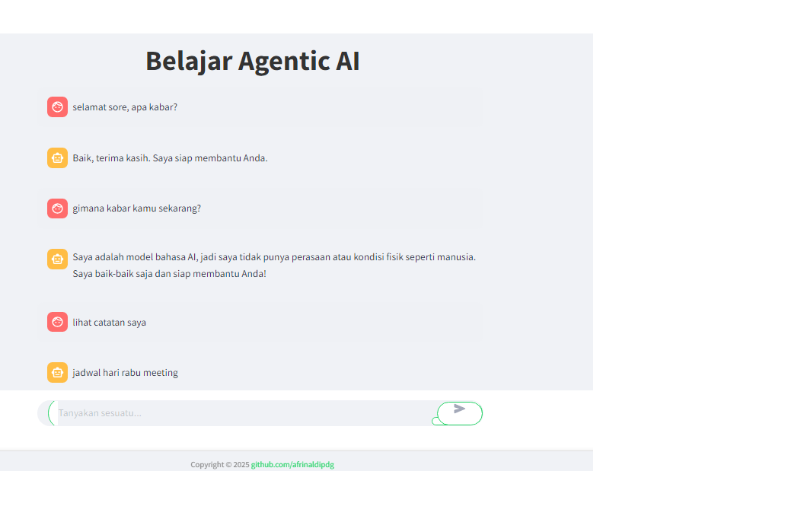

# 🔮 Agentic AI Streamlit

**Agentic AI Streamlit** adalah aplikasi web interaktif yang menggabungkan kekuatan agen AI otonom berbasis Gemini (gemini-2.5-flash) dengan framework LangChain, serta dukungan data dari Wikipedia dan layanan cuaca. Aplikasi ini dirancang untuk memberikan respons yang cerdas, kontekstual, dan otomatis terhadap pertanyaan pengguna melalui antarmuka berbasis Streamlit.

---

## 📌 Ringkasan Fitur

- ✅ **Agen AI Otonom** yang dapat mengambil keputusan dan melakukan tindakan.
- 🧠 **Pemrosesan Bahasa Alami** menggunakan model Gemini terkini dari google.
- 🎛️ **Antarmuka Interaktif** berbasis Streamlit yang mudah digunakan.
- 🔐 **Manajemen API Key Aman** menggunakan Streamlit Secrets.

---

## 🛠️ Instalasi dan Persiapan

### 1. Clone repositori

```bash
git clone https://github.com/afrinaldipdg/Agentic-AI-Streamlit.git
cd Agentic-AI-Streamlit

```
2. (Opsional) Aktifkan Virtual Environment

```
python -m venv venv
source venv/bin/activate        # macOS/Linux
venv\Scripts\activate           # Windows
```

3. Install dependensi
```

pip install -r requirements.txt
```
4. Konfigurasi API Key
Buat file .env dan isi dengan format berikut:
```
OPENAI_API_KEY = "sk-xxxxxxx"
```
Gantilah sk-xxxxxxx dengan API key dari OpenAI milikmu.
Jika kamu menggunakan Streamlit Cloud, kamu bisa menyimpan secret ini langsung dari dashboardnya.

🚀 Menjalankan Aplikasi
Untuk menjalankan aplikasi secara lokal:

```
streamlit run app.py
```
Buka browser dan akses: http://localhost:8501

🧠 Cara Kerja Agent
Pengguna mengetik pertanyaan di antarmuka Streamlit.

Agen AI akan mengevaluasi konteks pertanyaan:

Agen mengembalikan jawaban dalam format percakapan.

📂 Struktur Direktori
```
Agentic-AI-Streamlit/
├── tools
    ├── memory_tool.py
    ├── search_tool.py
    └── calc_tool.py
├── style.css    
├── app.py                  # Entry point aplikasi Streamlit
├── agent.py             # Logika LangChain Agent dan Tool
├── main.py
├── requirements.txt        # Daftar dependensi Python
└── .env                   # Tempat penyimpanan API key (jangan commit!)
```
🧰 Teknologi yang Digunakan
```
Teknologi	Keterangan
Python	Bahasa pemrograman utama
Streamlit	Web UI sederhana & cepat
OpenAI API	Pemrosesan bahasa alami
LangChain	Framework untuk AI agent dan tools
Wikipedia API	Sumber informasi ensiklopedia
API Cuaca	Info cuaca real-time (jika digunakan)
```
📸 Screenshot




💡 Ide Pengembangan Lanjutan
```

🔍 Integrasi dengan Google Search atau DuckDuckGo untuk hasil real-time.

💬 Chat memory agar AI mengingat konteks percakapan sebelumnya.

📁 Integrasi file upload untuk ekstraksi informasi dokumen.

🌎 Lokalisasi bahasa (multi-bahasa).

📊 Logging atau visualisasi reasoning agent secara real-time.

```

🤝 Kontribusi
Ingin berkontribusi? Mantap! Ikuti langkah berikut:

Fork repositori ini.

Buat branch baru untuk fitur atau perbaikan:

```
git checkout -b fitur-baru

```
Commit perubahanmu:

```

git commit -m "Menambahkan fitur baru"

```
Push ke branch milikmu:

```
git push origin fitur-baru

```

📄 Lisensi
Repositori ini menggunakan lisensi MIT. Silakan lihat file LICENSE untuk detail lebih lanjut.

📬 Kontak
Dikembangkan oleh Afrinaldi
Untuk pertanyaan atau kolaborasi, silakan buat issue atau hubungi melalui GitHub.

Terima kasih telah menggunakan Agentic AI Streamlit! 🌟
